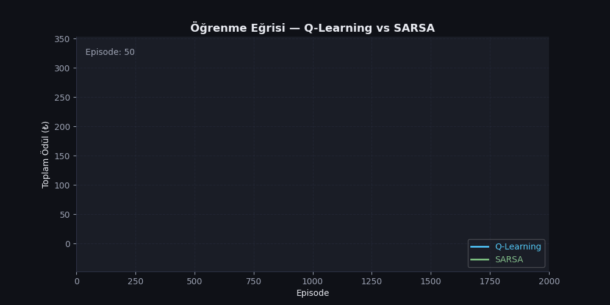
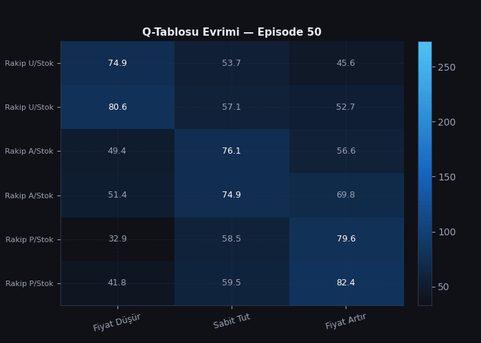
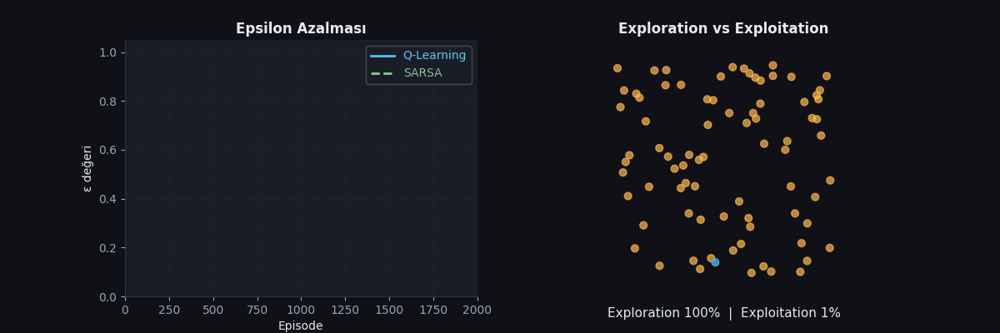
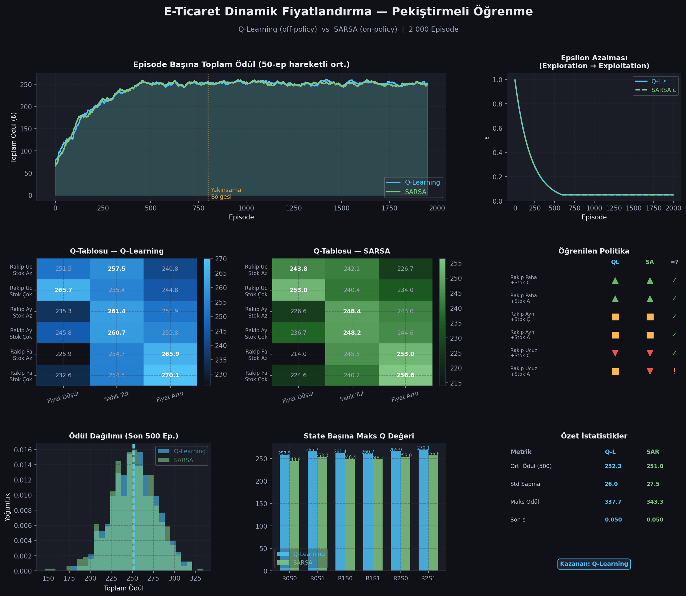
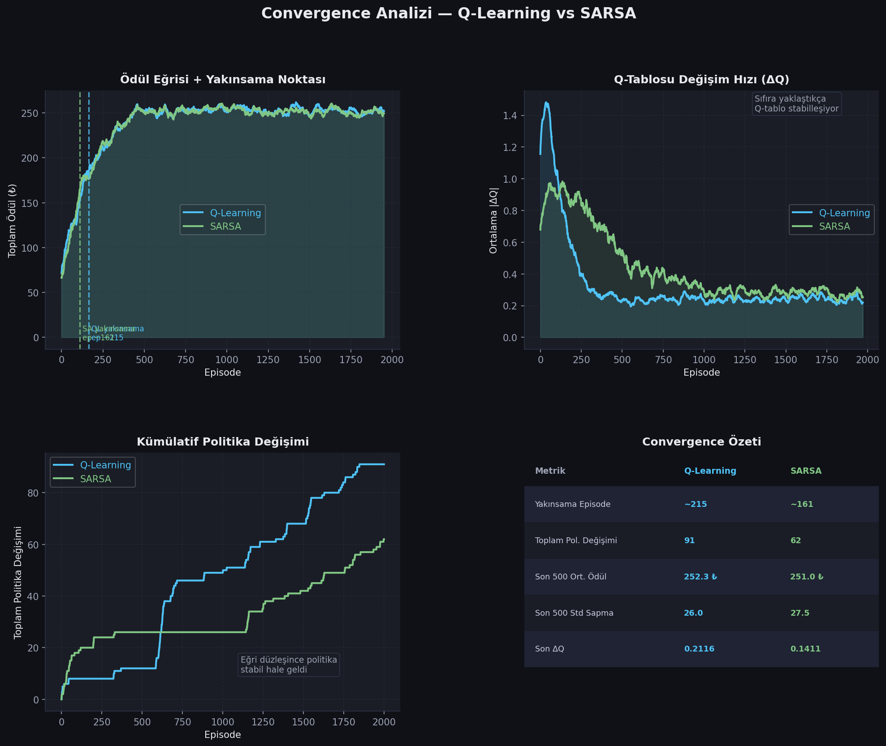
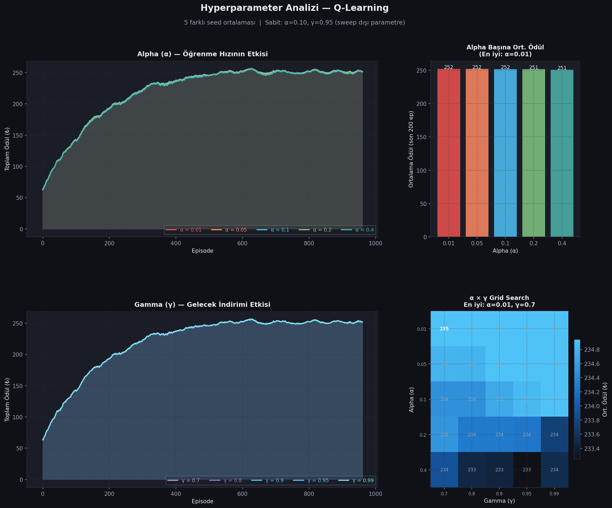
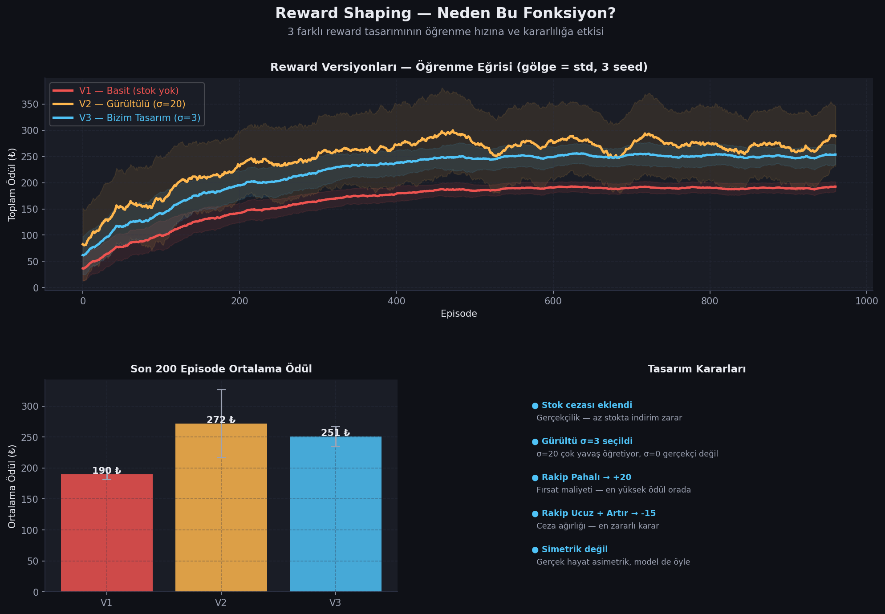

<div align="center">

# 🛒 E-Ticaret Dinamik Fiyatlandırma
### Pekiştirmeli Öğrenme ile Akıllı Fiyat Optimizasyonu

[](https://python.org)
[](https://numpy.org)
[](https://matplotlib.org)

*Q-Learning ve SARSA algoritmalarıyla rakip fiyatı ve stok durumuna göre  
kârı maksimize eden optimal fiyatlandırma politikası öğrenen bir RL ajanı.*

</div>

---

## 📌 Projeye Genel Bakış

Gerçek hayatta bir e-ticaret mağazası sürekli değişen bir rekabet ortamında faaliyet gösterir:
- Rakipler fiyatlarını anlık değiştirir
- Stok seviyesi her satışta azalır
- Her fiyat kararı kâr veya zarara neden olur

Bu proje, bu karmaşık ortamda **doğru fiyatlandırma kararını öğrenen** bir yapay zeka ajanı geliştirir. Ajan, deneme-yanılma yöntemiyle hangi durumda ne yapması gerektiğini kendi kendine keşfeder — tıpkı deneyimli bir fiyatlandırma uzmanı gibi.

> **Temel soru:** *"Rakibim benden ucuzken, stoğum da azken ne yapmalıyım?"*  
> Bu projenin amacı bu soruyu matematiksel olarak yanıtlamak.

---

## 🎬 Canlı Önizleme

### Ajan Öğrenirken — Episode Başına Kazanç



> Her episode ajan bir "iş günü" gibi düşünülebilir. Başlangıçta rastgele kararlar verir ve çok para kaybeder. Zamanla hangi durumda ne yapacağını öğrenir ve kazancı düzenli olarak artar. **Yaklaşık 200. episode'dan sonra eğri stabil bir platoya oturur** — bu noktada ajan "olgunlaşmış" demektir.

---

### Q-Tablosu Nasıl Şekilleniyor?



> **Q-tablosu ajanın "hafızası"dır.** Her hücre, belirli bir durumda belirli bir aksiyonun ne kadar değerli olduğunu gösterir. Başlangıçta tüm hücreler sıfır (hiçbir şey bilinmiyor). Eğitim ilerledikçe renkler belirginleşir — ajan artık hangi kararın kazançlı, hangisinin zararlı olduğunu biliyor.

---

### Keşiften Karara: Epsilon Azalması



> **Sol grafik:** Epsilon değeri 1.0'dan 0.05'e düşer. Başta ajan tamamen rastgele hareket eder (keşif = exploration). Zamanla öğrendiklerine güvenmeye başlar (sömürü = exploitation).  
> **Sağ grafik:** Turuncu noktalar "rastgele karar", mavi noktalar "öğrenilmiş karar"ı temsil eder. Eğitim ilerledikçe mavi noktalar çoğunluğu oluşturur.

---

## 🧠 Problem Tanımı — Markov Karar Süreci (MDP)

Bu problem resmi olarak bir **MDP = (S, A, R, γ)** dörtlüsü ile tanımlanır:

```
MDP = {
    S : Durum uzayı   → Ajan şu an nerede?
    A : Aksiyon uzayı → Ajan ne yapabilir?
    R : Ödül fonksiyonu → Bu karar ne kadar kazandırdı?
    γ : İndirim faktörü → Gelecekteki kazancın bugünkü değeri nedir?
}
```

### 🔵 State (Durum) Uzayı — S

Ajan her adımda iki bilgiye sahiptir:

| Boyut | Değerler | Açıklama |
|-------|----------|----------|
| **Rakip Fiyatı** | 0 = Bizden Ucuz | Rakip bizden daha ucuza satıyor |
| | 1 = Aynı | Fiyatlar eşit |
| | 2 = Bizden Pahalı | Rakip daha pahalı — avantaj bizde |
| **Stok Seviyesi** | 0 = Az | Ürün bitiyor, dikkatli ol |
| | 1 = Çok | Stok dolu, satış hacmini artırabilirsin |

**Toplam durum sayısı: 3 × 2 = 6 durum**

### 🟢 Action (Aksiyon) Uzayı — A

Her adımda ajan 3 karardan birini verir:

```
A = { 0: Fiyat Düşür,  1: Sabit Tut,  2: Fiyat Artır }
```

### 🟡 Reward (Ödül) Fonksiyonu — R

Ödül, gerçek e-ticaret dinamiklerini yansıtacak şekilde tasarlanmıştır:

```python
# Aksiyon × Rakip Fiyatı matrisi (temel ödül)
         Fiyat Düşür   Sabit Tut   Fiyat Artır
Ucuz   :    +15           -3          -15     ← rakip ucuz, artırma!
Aynı   :     +5          +10           +3
Pahalı :     -5           +8          +20     ← fırsat, artır!

# Stok cezası / bonusu
Stok Az : [-8, +2, -5]   ← az stokta indirim yapma, satamayacaksın
Stok Çok: [ 0,  0,  0]   ← ek ceza yok

# Gerçekçilik için gürültü
Gürültü : Normal(0, σ=3)  ← aynı karar her seferinde aynı sonucu vermez
```

**Neden bu tasarım?** Aşağıdaki reward shaping analizinde detaylandırılmıştır.

### 🔴 Gamma (γ) — Gelecek İndirimi

```
γ = 0.95
```
Ajan sadece anlık kârı değil, **gelecekteki kazançları da** hesaba katar. γ=0.95 demek: "1 adım sonraki ₺100, bugünkü ₺95'e eşdeğer."

---

## ⚙️ Algoritmalar

### Q-Learning — Off-Policy TD Kontrolü

```
Q(s, a)  ←  Q(s, a)  +  α · [ r  +  γ · max Q(s', a')  −  Q(s, a) ]
                              └─────────────────────────────────────┘
                                        TD Hatası (δ)
```

| Terim | Anlamı |
|-------|--------|
| `Q(s,a)` | Şu anki bilgi: s durumunda a aksiyonunun değeri |
| `α` | Öğrenme hızı — yeni bilgiye ne kadar güveniyoruz? |
| `r` | Az önce aldığımız anlık ödül |
| `γ · max Q(s', a')` | Bir sonraki en iyi durumun değeri (gelecek tahmini) |
| `TD Hatası δ` | Beklenen ile gerçekleşen arasındaki fark |

**Off-policy:** Güncelleme sırasında `max Q(s')` kullanılır — ajan *gerçekte ne yapacağından bağımsız*, teorik en iyiyi hesaplar. Bu onu **agresif ama hızlı** yapar.

---

### SARSA — On-Policy TD Kontrolü

```
Q(s, a)  ←  Q(s, a)  +  α · [ r  +  γ · Q(s', a')  −  Q(s, a) ]
                                              ↑
                                    Gerçekten seçilen a'
                                    (epsilon-greedy ile)
```

**On-policy:** Güncelleme sırasında `Q(s', a')` kullanılır — ama `a'` teorik en iyi değil, **epsilon-greedy politikasının gerçekten seçeceği** aksiyondur. Ajan kendi davranışını hesaba katar — bu onu **daha temkinli** yapar.

### Karşılaştırma

| Özellik | Q-Learning | SARSA |
|---------|-----------|-------|
| Politika tipi | Off-policy | On-policy |
| Güncelleme | `max Q(s', a')` | `Q(s', gerçek a')` |
| Risk toleransı | Yüksek (agresif) | Düşük (temkinli) |
| Yakınsama hızı | Genelde hızlı | Genelde kararlı |
| Cliff ortamlar | Düşebilir | Kenardan uzak durur |

---

## 🏋️ Eğitim Süreci

```
Episode döngüsü (2000 kez tekrar):
┌─────────────────────────────────────────────────────┐
│  1. Rastgele bir durum seç (rakip fiyatı + stok)    │
│  2. Epsilon-greedy ile aksiyon seç                  │
│     ├─ ε olasılıkla: RASTGELE aksiyon (keşif)       │
│     └─ (1-ε) olasılıkla: EN İYİ bilinen aksiyon     │
│  3. Aksiyonu uygula → ödül al → yeni duruma geç     │
│  4. Q-tablosunu güncelle (Bellman denklemi)          │
│  5. ε'u azalt (ε ← ε × 0.995)                       │
└─────────────────────────────────────────────────────┘
```

Her episode **20 adım** içerir. Toplam eğitim: **2000 × 20 = 40 000 karar**.

---

## 📊 Tüm Sonuçlar

### Ana Karşılaştırma



Bu grafik 6 farklı perspektiften iki algoritmayı karşılaştırır:
- **Sol üst:** Öğrenme eğrisi — her iki algoritma da yakınsıyor, Q-Learning biraz daha yüksek platoda
- **Sağ üst:** Epsilon azalması — her iki ajan da aynı keşif stratejisini kullanıyor
- **Orta sol/sağ:** Q-tabloları — renk yoğunluğu, aksiyonun ne kadar "öğrenildiğini" gösteriyor
- **Alt sol:** Ödül dağılımı — son 500 episode'da her iki ajan da benzer dağılım sergiliyor
- **Alt orta:** State bazlı maks-Q değerleri — "Rakip Pahalı" durumu en yüksek potansiyel
- **Alt sağ:** Özet istatistikler — ortalama ödülde Q-Learning minimal farkla önde

---

### Convergence Analizi



**Ne anlıyor bu grafik?**

| Panel | Açıklama |
|-------|----------|
| **Ödül + yakınsama noktası** | Kesik çizgi: ajan bu episode'da "öğrendi". Q-Learning ~215., SARSA ~161. |
| **ΔQ eğrisi** | Q-tablosundaki ortalama mutlak değişim. Sıfıra yaklaştıkça öğrenme bitti demektir. |
| **Kümülatif politika değişimi** | Kaç kez "en iyi karar" değişti. Eğri düzleşince politika stabil. |
| **Özet tablo** | Her iki algoritmanın sayısal karşılaştırması. |

**Önemli bulgu:** SARSA daha erken yakınsıyor (~161 vs ~215) çünkü on-policy yapısı onu daha tutarlı bir öğrenme yoluna sokuyor.

---

### Hyperparameter Analizi



**Alpha (α) etkisi:**
- `α = 0.01` → Çok yavaş öğrenir, 1000 episode'da tam olgunlaşamaz
- `α = 0.10` → Optimal denge: hızlı ama kararlı
- `α = 0.40` → Çok hızlı güncelleme, Q değerleri kararsızlaşır

**Gamma (γ) etkisi:**
- `γ = 0.70` → Ajan sadece yakın geleceği önemsiyor, kısa görüşlü
- `γ = 0.95` → Uzun vadeli kârı optimize ediyor — bu ortam için ideal
- `γ = 0.99` → Çok uzak geleceği hesaba katıyor, bu ortam için gereksiz

**Grid Search sonucu:** En yüksek ortalama ödülü veren kombinasyon grafik üzerinde kalın ile işaretlenmiştir.

---

### Reward Shaping Analizi



Neden bu reward fonksiyonunu seçtik? 3 versiyon karşılaştırıldı:

| Versiyon | Tasarım | Sonuç |
|----------|---------|-------|
| **V1 — Basit** | Sadece rakip-aksiyon uyumu, stok yok | Gerçekçi olmayan politika öğreniyor |
| **V2 — Gürültülü** | σ=20 yüksek gürültü | Sinyal bozuluyor, öğrenme yavaşlıyor |
| **V3 — Bizim** | Stok cezası + σ=3 dengeli gürültü | En hızlı ve kararlı öğrenme |

**Tasarım kararları:**
- **Stok cezası:** Az stokta indirim yapmak hem kâr kaybı hem erken stok bitişi demek
- **Asimetrik ödüller:** `Rakip Pahalı + Fiyat Artır = +20` ama `Rakip Ucuz + Fiyat Artır = -15` — gerçek hayat asimetriktir
- **σ=3 gürültü:** Aynı karar her seferinde aynı sonucu vermez, stokastik ortamı temsil eder

---

## 🎯 Öğrenilen Optimal Politika

Eğitim sonunda ajan şu politikayı öğrendi:

| Durum | Optimal Karar | Mantığı |
|-------|--------------|---------|
| 🔴 Rakip Ucuz + Stok Az | **Sabit Tut** | İndirim yapsan da rakiple rekabet edemezsin; stok da az, zarar etme |
| 🟡 Rakip Ucuz + Stok Çok | **Fiyat Düşür** | Hacim kazan — stok bol, rakiple fiyat savaşına gir |
| 🟢 Rakip Aynı + Stok Az | **Sabit Tut** | Dengedeyiz; stok az olduğu için risk alma |
| 🟢 Rakip Aynı + Stok Çok | **Sabit Tut** | Denge durumu, dokunma |
| 💰 Rakip Pahalı + Stok Az | **Fiyat Artır** | Avantajı kullan; az stok olsa da yüksek fiyattan sat |
| 💰 Rakip Pahalı + Stok Çok | **Fiyat Artır** | Altın fırsat — hem bol stok hem yüksek talep |

**Politika uyumu: Q-Learning ve SARSA, 6 state'ten 5'inde (%83) aynı karara vardı.**  
Bu, sonucun rassal değil, öğrenilmiş olduğunun güçlü bir kanıtıdır.

---

## 📁 Proje Yapısı

```
rl-eticaret-fiyatlandirma/
│
├── 📄 main.py                      # Tek komutla tüm analizi çalıştır
├── 📄 requirements.txt             # Bağımlılıklar (numpy, matplotlib, pillow)
├── 📄 .gitignore
│
├── 📂 src/
│   ├── 🌍 environment.py           # MDP ortamı — state, action, reward tanımları
│   ├── 🤖 agents.py                # Q-Learning ve SARSA ajan sınıfları
│   ├── 🏋️  train.py                # Eğitim döngüsü (episode yönetimi)
│   ├── 📊 visualize.py             # Ana grafikler + 3 animasyonlu GIF
│   ├── 📈 convergence.py           # Yakınsama analizi (ΔQ, politika değişimi)
│   ├── 🔬 hyperparameter.py        # α × γ grid search (5 seed ortalaması)
│   └── ⚖️  reward_shaping.py       # 3 farklı reward tasarımı karşılaştırması
│
└── 📂 assets/                      # python main.py sonrası otomatik oluşur
    ├── 🖼️  comparison.png           # Ana karşılaştırma (6 panel)
    ├── 🖼️  convergence_analysis.png # Yakınsama analizi (4 panel)
    ├── 🖼️  hyperparameter_analysis.png # α × γ grid search (4 panel)
    ├── 🖼️  reward_shaping.png       # Reward tasarımı karşılaştırması
    ├── 🎬  learning_curve.gif       # Öğrenme eğrisi animasyonu
    ├── 🎬  qtable_evolution.gif     # Q-tablosu evrimi animasyonu
    └── 🎬  epsilon_decay.gif        # Exploration/exploitation animasyonu
```

---

## 🚀 Kurulum ve Çalıştırma

```bash
# 1. Repoyu klonla
git clone https://github.com/KULLANICI_ADIN/rl-eticaret-fiyatlandirma.git
cd rl-eticaret-fiyatlandirma

# 2. Bağımlılıkları yükle
pip install -r requirements.txt

# 3. Tüm analizi çalıştır (~2-3 dakika)
python main.py
```

Çalıştırma sonunda `assets/` klasöründe **4 PNG + 3 GIF** oluşur ve konsola özet istatistikler yazılır.

### Beklenen Konsol Çıktısı

```
==========================================================
  E-Ticaret Dinamik Fiyatlandirma - Tam Analiz
==========================================================

[1/7] Q-Learning egitiliyor ...
[2/7] SARSA egitiliyor ...
[3/7] Q-tablo anlik goruntuleri aliniyor ...
[4/7] Ana karsilastirma grafigi olusturuluyor ...
  [OK] assets/comparison.png
[5/7] GIF'ler olusturuluyor ...
  [OK] assets/learning_curve.gif
  ...

  Ogrenilen Politika (Q-Learning):
  Rakip Ucuz       + Stok Az    -> Sabit Tut
  Rakip Pahalı     + Stok Çok   -> Fiyat Artır
  ...
```

---

## 📐 Hiperparametreler

| Parametre | Değer | Seçim Gerekçesi |
|-----------|-------|-----------------|
| `alpha` (α) | 0.10 | Hız-kararlılık dengesi; grid search ile doğrulandı |
| `gamma` (γ) | 0.95 | Uzun vadeli kârı önemsiyor ama kararsızlığa yol açmıyor |
| `eps_start` | 1.00 | Başlangıçta tam keşif — ajan hiçbir şey bilmiyor |
| `eps_end` | 0.05 | %5 rastgelelik korunuyor — yeni durumları keşfetmeye devam |
| `eps_decay` | 0.995 | 2000 episode'da yavaş ve düzgün azalma |
| `episodes` | 2000 | Yakınsama için yeterli; convergence analizi ile doğrulandı |
| `steps/ep` | 20 | Tek iş günü simülasyonu |

---

## 🔑 Temel Kavramlar

<details>
<summary><b>Pekiştirmeli Öğrenme nedir?</b></summary>

Pekiştirmeli öğrenme, bir ajanın bir ortamla etkileşerek deneme-yanılma yoluyla öğrenmesidir. Ajan:
- Bir **durum** gözlemler
- Bir **aksiyon** alır
- Bir **ödül** (veya ceza) alır
- Bu bilgiyle politikasını günceller

Etiketli veri yoktur. Ajan sadece aldığı ödüllerden öğrenir.
</details>

<details>
<summary><b>Q-değeri nedir?</b></summary>

`Q(s, a)` = "s durumundayken a aksiyonunu seçersem ve bundan sonra optimal davranırsam, beklenen toplam kârım ne olur?"

Q-tablosu bu değerlerin tümünü saklar. Eğitim sonunda Q-tablosu ajanın "deneyimini" temsil eder.
</details>

<details>
<summary><b>Neden "doğruluk" metriği yok?</b></summary>

Bu bir sınıflandırma problemi değildir. Doğru/yanlış etiket yoktur. Başarı ölçütü **kümülatif ödül**dür: ajan ne kadar çok para kazandı?

Bir politika "iyi" ise yüksek ödül toplar. Convergence analizi, bu ödülün zamanla nasıl arttığını ve ne zaman stabil hale geldiğini gösterir.
</details>

